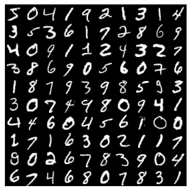

# *GANs - 👑dom of Generative Models*
  * *Generative Adversarial Networks simply GAN's are powerfull generative models that can model the distribution 🖼 of Real data.*
  * *GAN's are defacto for realistic Image generation until the araise of diffusion models 🧠🦾.*
  * *GAN's has two models* **Generator** *and* **Discriminator.** 
  * *Generator try to generate images that are very close to real and Discriminator (act as classifier) try to distinguish from Real/Fake images distribution.*
  * *GAN's are learned by playing **minmax game**.Where Generator try to minimize the difference b/w real and fake at the same time Discriminator try to maximize the difference b/w real and fake.*
  * *So in this repo i Implemented and trained some of the gan's. I did make sure that Implemented gan's are follow the same Alg/Architecture details as proposed in paper.If i made mistake in any of the implementations let me know.....*
    
# *Training*
   * *As a Default we can train gan's either Mnist or CelebA dataset*.
   * *By giving **-cA** flag CelebA will be training dataset else Mnist*.
   * *Using **-h** flag you will get info about other arguments that are available*.
   * ***--ckp_interval** argument controls How often we wanna save checkpoints (trained weights) of models. As default checkpoint will be saved after every 200 steps of training.Training checkpoints will be stored in [models/checkpoints](models/checkpoints) dir (this dir will be created/appear only when training or after training).*
   * *If you don't like training or even look at models in script format like me use [NOTEBOOKS](notebooks).*
   * *[Colab Notebook](notebooks/colab_gans.ipynb) contains all the implementation of gan&training from scartch.*
   * *[Kaggle Notebook](notebooks/kaggle_gans.ipynb) contains implementation of only 1or2 gan variants but it's uses DDP for training sorta good to know.*
   #### [GAN](models/gan/GAN.py)   
        python GAN.py --lr=0.0002 --latent_dim=100   
   #### [DCGAN](models/dcgan/DCGAN.py)
        python DCGAN.py --lr=0.0002 --k=1 --latent_dim=100
   #### [WGAN](models/wgan/WGAN.py)
        python WGAN.py --lr=0.00005 --n_critic=5 -c=0.01 --latent_dim=100
   #### [WGAN_GP](models/wgan_gp/WGAN_GP.py)
        python WGAN_GP.py --lr=0.0001 --n_critic=5 --lamda=10 --latent_dim=100
   #### [TGAN_SVC](models/tgan_svc/TGAN_SVC.py)
        python TGAN_SVC.py --lr=0.00005 --n_critic=5 --latent_dim=100

  *Above CLI arguments are specific to each variant but some other CLI arguments like*

      --batch_size --epochs --print_interval --ckp_interval 

  *These Arguments are common to all gan so you can fun with that if you wanna.*

       
# *Dependencies*
    pip install torch torchvision moviepy IPython

# *Sampling From GAN's*

 <h4>original -------->&nbsp&nbsp&nbsp&nbsp&nbsp&nbsp&nbspGAN ---------->&nbsp&nbsp&nbsp&nbsp&nbsp&nbsp&nbsp DcGAN ------> &nbsp&nbsp&nbsp&nbsp&nbspWGAN(on celebA dataset) </h4>
  
  
  
  

